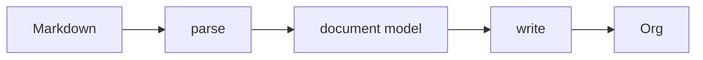

# Design

1. md2org converts Markdown markup to Org markup.
2. Some Markdown markup is converted only in part, or not at all.
3. Source text that isn't Markdown markup passes through unchanged.



## Invariants
1. Every non-markup character in the source appears in the output, except the alt
   text of an image inside a link description, which Org has nowhere to put.
2. Contents of Markdown code blocks are never transformed, except by Org's own
   comma-quoting, which Org reverses on read.
3. Contents of Markdown comments are never transformed.
4. If any text in the source happens to be valid Org syntax that changes how Org
   *parses* the document, it is reported in the Warnings Footer.
5. Table cell content is never processed as headings or lists.

Invariant 4 is about the parse and nothing else. Syntax that Org parses exactly
as intended, and then exports oddly or not at all, is a different class with a
different remedy: it is documented rather than warned, under *Survives the parse,
not the export* below. Mixing the two would put a warning on every `$x$` in the
document and drown the structural ones that matter.

## Raw HTML

Markdown has allowed HTML since Gruber's original spec, and CommonMark gives the
two forms different rules. md2org follows the parser rather than second-guessing
it, because the parser has already decided which of them the author wrote.

**Inline HTML is transparent.** In `See <b>**bold** and \`code\`</b> here.` the tags
are raw but nothing else is: the text around and between them was parsed, and
`**bold**` and `` `code` `` arrive as a strong node and a code span, siblings of
the tags rather than their contents. So they convert normally and each tag becomes
its own `@@html:…@@` snippet. The correspondence is exact in both directions —
Org's snippet is self-contained too, not an opening and closing pair.

**A block is opaque.** CommonMark suspends parsing for the whole region and the
literal is the region entire, tags and prose alike. There is no Markdown inside it
to convert, so it passes through whole into `#+BEGIN_EXPORT html`, which is Org's
construct for exactly this: content addressed to the HTML backend. A LaTeX or
ASCII export dropping it is not a loss — nothing in there was ever addressed to
them. Comma-quoting keeps a line inside the region from closing the block early,
and works because the content stays inside a block, which is the only place Org
honours it.

The blank-line rule is what separates the two, and it is a fair proxy for intent:
an author who wants Markdown parsed inside their `<details>` leaves a blank line,
and one who has stopped writing Markdown and started writing a chunk of layout
does not.

### Comments

An HTML comment is the only comment a Markdown author has. Neither Gruber's spec
nor CommonMark defines one, so `<!-- … -->` is the idiom, and md2org converts it
as what the author meant rather than as what it literally is: a one-line comment
becomes `# …`, and so does every line of a multi-line one. That is a change of
kind — an Org comment is dropped by every backend, where an HTML comment survives
into HTML output — and it is the right one, because a note to self is what the
construct is used for.

A run of comment lines rather than a comment block, because `#+BEGIN_COMMENT` is
the one lesser block whose contents Org does not unquote. `src`, `example` and
`export` all reverse the comma on read; `org-element-comment-block-parser` has no
unescape at all, so a comma put there to stop `#+END_COMMENT` closing the block
early would stay in the author's text for good. A `#` prefix needs no quoting: it
puts every line of the body off column 0, where neither a delimiter nor a
headline can be recognised, and Org strips the `#` and one space on read, so the
body comes back exactly as written.

The awkward case is a comment tangled up with a stretch of HTML, where the
comment belongs to the markup rather than to the author. CommonMark has already
decided that one, and the answer is the rule this section already follows: **a
comment becomes an Org comment exactly when it forms its own HTML block.** A
comment absorbed into a larger region is part of that region's literal and never
reaches the comment path at all.

The start conditions do the work. A block opened by `<div>` or `<details>`
(condition 6) ends at a blank line, so a comment written inside one with no blank
line around it stays in the export block. `<pre>` and its fellows (condition 1)
end at their closing tag and swallow blank lines as well. A comment (condition 2)
ends at the line holding `-->`, so it never opens a region: a comment on its own
line is its own block, whatever follows it.

| Source | Becomes |
|---|---|
| a comment inside `<div>…</div>`, no blank lines | part of the export block |
| a comment inside `<pre>`, blank lines and all | part of the export block |
| a comment on the line directly above `<div>` | an Org comment, then an export block |
| a comment with blank lines around it | an Org comment |
| a comment with text after `-->` | an export block, which keeps the trailing text |

A blank line splits an HTML region into several export blocks, so *the literal is
the region entire* holds for the block CommonMark built, not for the region the
author had in mind. A comment written between blank lines inside a `<details>` is
an Org comment for that reason, and it follows the blank-line proxy: an author
who leaves blank lines has asked for Markdown parsing, and a comment is what
Markdown parsing finds there.

Up to three spaces of indentation are allowed before any start condition, so an
indented comment is the same construct as one at column 0 and converts the same
way.

**An inline comment is the exception.** `text <!-- c --> more` is a comment by the
same reasoning, but Org has no inline comment and `#` is a whole-line construct,
so honouring it would break the paragraph. It takes the `@@html:…@@` path along
with every other inline tag, which makes it the one comment that survives into
HTML output.

## Starting point: GitHub Flavoured Markdown (GFM)

Then apply the following.

### Convert

Not in the GFM spec, but converted to an Org equivalent.

- Footnotes

### Pass through, silently

GFM that is not converted. It appears in the Org output as it was in the source,
unescaped.

- Character references, of every kind. `&mdash;` and `&hellip;`, `&#65;` and
  `&#x41;` all reach the file exactly as the author typed them.

One construct, one rule, no exceptions. Until 1.1.0 the numeric ones were decoded
and the named ones were not, on the grounds that a rule costs almost nothing where
a 99 KB table does not. That was a size answer to a question the reader was asking
about meaning, and it left the same construct with two behaviours.

Keeping the decoding turned out to be the wrong half, for a reason unrelated to
size. Decoding produces characters, and in Org several of those characters are
syntax:

| Source | Decoded to | What Org made of it |
|---|---|---|
| `&#42; foo` | `* foo` | a level-1 headline |
| `&#35; foo` | `# foo` | a comment, so the line left every export |

An author writes `&#42;` precisely so an asterisk is not read as markup. In an
HTML renderer decoding it is safe, because `*` means nothing in HTML. Decoding it
into Org manufactures the markup the escape existed to prevent — the same mistake
as generating `\vert{}`, reached from the other end. The second row is the worse
one: nothing warned, and the line was gone from the export with every character
still present in the file.

The cost is that a reader sees `&mdash;` where Org exports to HTML, because Org
escapes the ampersand. That is a display loss on a construct md2org cannot
represent, against a structural loss it was causing itself. It is also the whole
of the conformance gap: thirteen of the spec's 652 examples, counted in
`test/conformance.js`.

md2org generates no Org entities. There is no `\vert{}`, no `\zwnj{}`, no
`\name{}`. The output contains only characters the author wrote, plus the Org
markup md2org emits for the constructs it converts.

This is not only tidiness. Both entities md2org used to generate could be captured
by an author's own `=` or `~`, and Org does not expand an entity inside a verbatim
span — §Text Markup makes CONTENTS a literal string — so the escape that was
supposed to be invisible was printed to the reader instead. An escape that can be
captured by the text it sits in is not an escape.

### Pass through, with a warning

Passed through untouched, and listed in the Warnings Footer, because Org parses
the result differently from the way the source read. This list is invariant 4.

| Source text | What Org does with it |
|---|---|
| `]]` inside a link description | the link ends early and the rest becomes text |
| a line Org reads as a headline | a heading appears, claiming everything until the next heading of equal or lower level |
| `\|` in a table cell | Org has no escape for a cell, so the cell splits and the backslash stays in the output |
| `#+BEGIN_…` or `#+END_…` on its own line | pairs with a delimiter md2org emitted, opening or closing a block |
| `[[Some Page]]` | read as an Org link |
| a line Org reads as a comment | the line is dropped from every export |

The headline row is stated as an outcome rather than a construct, because more
than one route reaches it and naming them was how the check kept going wrong.
`** text` in prose is the obvious one. A line inside a block quote is another. So
is `__** * **__`, where Org's strong-emphasis marker is an asterisk and md2org's
own conversion puts three of them at the start of a line — nobody wrote those and
Org still reads a headline.

So the test is on the finished line and admits one exemption: a headline md2org
declared at the moment it emitted one, which is the only point where the answer is
known rather than reconstructed. Everything else that reads as a headline is
reported.

A level-1 heading is not known to arise. A single `*` and a space is always a
Markdown bullet, CommonMark forbids an emphasis opener followed by whitespace so a
converted `__…__` never yields `* `, and an asterisk inside an HTML block never
leaves the block.

This was written as *cannot* until 1.1.0, and it was wrong: `&#42; foo` decoded to
`* foo` and Org read a headline, by a route none of the three above describes. The
route is closed — character references are no longer decoded — but the correction
worth keeping is that the list is an argument and not a proof, so the claim is
stated as what has been looked for rather than what is impossible. The warning
fires either way, because the check is on the finished line rather than on the
constructs enumerated here, which is the whole reason it survived being wrong.

The comment row is the same shape and worse in effect. A headline keeps its text
on the page and only re-parents what follows; a comment takes the line out of
every backend, and every character is still in the file, so invariant 1 holds and
cannot see it. The common route is not exotic: `\#` is CommonMark's own escape for
a literal hash at line start, the parser consumes the backslash because the
backslash is Markdown markup, and the bare `#` that remains is an Org comment.
Org offers no escape for a leading `#` in a paragraph, so this is passed through
and reported like its neighbours.

Org wants `#` followed by whitespace or end of line, so `#1 fixed` stays a
paragraph and `#+TITLE:` is a keyword. Two exemptions: a comment md2org emitted
itself, and the body of a block whose contents Org does not parse. The second is
not optional — `# ` is the most ordinary line in a shell or Python fence, and Org
reads no comment there, so warning would be a false finding on nearly every
document converted. The headline check gets that protection free, because a block
body is comma-quoted for `*` and `#+` lines; a bare `# ` is not, so it has to be
stated. A quote block is the opposite case and must still be reported: its
contents are parsed, and a comment inside one does leave the export.

### Lossy conversion

Markup md2org silently strips. The characters that go are markup, so invariant 1
is not engaged — with one exception, the alt text, which is prose the author
wrote rather than markup. Org allows a link description to hold only a plain or
angle link, so a badge's description becomes the image path and the alt text has
nowhere to go. Invariant 1 names it as an exception rather than pretending it is
markup.

- A link title. `[text](/url "title")`
- Alt text on a badge. `[](/url)` — the exception above
- `[text]()` becomes `text`
- `[Install](#install)` becomes `Install`

### Survives the parse, not the export

Org parses these the way the document intends. The export is where the content
goes missing. Not structural, so not warned under invariant 4; recorded here
instead, because the list is known to be incomplete and a warning implies a
completeness this class does not have.

| Construct | Where it comes from | What the export does |
|---|---|---|
| A heading whose first word is `COMMENT` | **md2org generates it**, from an ordinary Markdown heading | drops that entire section |
| Raw inline HTML, including `<<anything>>` | md2org wraps it `@@html:…@@` | the tag is dropped for every backend but HTML, so a tag whose content is its own name leaves nothing behind |
| `[fn:1] text` with nothing referencing it | passed through | the definition is dropped |
| `:LOGBOOK:` or `:PROPERTIES:` … `:END:` | passed through | drawer contents are dropped |
| `$x$` in prose | passed through | read as a LaTeX fragment; ASCII leaves it, LaTeX and HTML render it as maths |
| `: like this` at line start | passed through | comes out as boxed monospace |

The `COMMENT` row is the only one md2org causes itself, and the only one that
loses a whole section rather than a fragment.

## Warnings Footer

```org
# md2org warnings:
# heading: line 4
```

- **Output, not source, line numbers**
- One line per category of warning, followed by comma separated line numbers
- **Absent when there are no warnings.**
- The only place md2org puts words in the document that the author didn't write.
  Additive, never mutating.

## The parser is forked

We do not vendor commonmark.js; we maintain a modified copy. We measure
conformity to CommonMark using `test/conformance.js`, which runs the spec's own
652 examples as data. Upstream has had only three substantive spec releases in
seven years (0.29 2019, 0.30 2021, 0.31 2024, mostly typographical), and
commonmark.js last published 0.31.2 in September 2024.

The fork is necessary because GFM's delta is small but sits *inside* the block
parser. cmark-gfm's extension docs say AST post-processing is preferred when it
works, and the parser hooks exist for when a posteriori modification of the AST
proves too difficult to implement correctly — and GitHub uses the hooks for
tables. Footnotes there aren't an extension at all; they're a parser option,
because they race link reference definitions. A source-level pre-pass runs before
block structure exists, so it can't see containers, which is why tables and
footnote definitions inside lists and quotes go wrong.

micromark + GFM + mdast is 78.1 KB minified for an AST, against a whole-file
budget near 40 KB. The current parser is 29.6 KB.

`tools/build-vendor.js` patches upstream before bundling, so every edit is
visible in one place and asserted. The patches exist for provenance, not for
merging. We edit the parser freely, and prefer the smallest clean change over one
that preserves a diff that will likely never be needed in practice.

## Constraints

The iOS Shortcut's code field is binding. Bytes, line count and line length can
each crash it, and they interact: many short lines are worse than few long ones,
and both extremes crash. The reference shape is the build that was pasted
successfully and used to generate `shortcut/md2org.shortcut`:

| bytes  | lines | longest |
|--------|-------|---------|
| 39,054 |   115 |     631 |

`test/size.js` asserts the bytes and the line count, and carries the full table
of every dimension measured, crashes included. The longest line is recorded here
because it was part of that build, not because it is a limit: no paste has ever
failed on column count, and the number drifts by a character or two whenever the
minifier reassigns identifier names, so a build a little past 631 is not a
failure. The column check in `test/size.js` sits far above any of this, at 2,000,
where it guards a different phenomenon — a build with the whole parser on one
line, which is the one shape that did crash the editor.

## Known limitations

### Block delimiters can pair with ones md2org emits

A literal `#+END_SRC` in the source passes through, where it can close a block
md2org opened. A literal `#+BEGIN_SRC` can find its partner in the `#+END_SRC`
md2org emits for a real fence.

```
- x :: y                - x :: y
> quote                 #+BEGIN_QUOTE
&amp;          →        quote
#+END_SRC               &amp;
___                     #+END_SRC       ← closes the quote
                        #+END_QUOTE
```

Guarding it would cost `#+TITLE:` and friends passing through, which is one of
the contract's best features. It is warned rather than fixed, which is what the
Warnings Footer row buys.

`test/fuzz.js` reports a few per cent invalid Org because its corpus carries
these delimiters as fragments. That rate is an artifact of the corpus, not a
measure of real Markdown, and the corpus should not be tuned to hide it.

`fuzz.js` holds an `ACCEPTED` list of the failure signatures this issue produces,
reports them as a count, and exits zero; anything else fails the run. The
alternative — failing on a condition the design has decided not to fix — left the
suite with no green state, which cost the only thing a fuzzer is for.

### Static validation of the output is weaker than it was

`test/org-validate.js` was a total oracle: it could judge any output without
being told the answer, which is what makes `test/fuzz.js` work. Under the
contract, literal text can look like any Org markup, and nothing in the output
distinguishes text md2org copied from markup md2org generated. Three checks —
link shape, nested bracket links, bare-asterisk lines — had to go, because they
can no longer tell the two apart.

Invariant 1 is the replacement and is stronger where it applies: every non-markup
character in the source appears in the output. It is implemented as a property
test in `test/invariant.js`, which `test/fuzz.js` runs on every document it
generates, so it is checked against random input rather than a fixture list.
