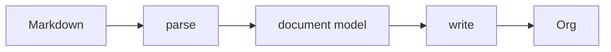

# Design

1. md2org converts Markdown markup to Org markup.
2. Source text that isn't Markdown markup passes through unchanged.



## Invariants
1. Every non-markup character in the source appears in the output.
2. Contents of Markdown code blocks are never transformed.
3. Contents of Markdown comments are never transformed.
4. If an Org entity is added by the transform, it is reported in the Warnings
   Footer. So is a construct that passes through unchanged but changes the
   document's structure when Org reads it.
5. Table cell content is never processed as headings or lists.

Invariant 1 is not implemented as a property test (see *Static
validation of the output is weaker than it was* below).

## How Org syntax in the source document fares

| token | Markdown | Org | resolution |
|---|---|---|---|
| `* x` | bullet list | heading L1 | **collision** → Markdown |
| `# x` | heading L1 | comment | **collision** → Markdown |
| `- x` `+ x` `1. x` | list | list | agree |
| `\| a \| b \|` | table | table | agree |
| `-----` | thematic break | horizontal rule | agree |
| `> x` | block quote | — | Markdown only |
| `** x` | — | heading L2+ | Org only |
| `#+KEYWORD:` `: x` `:NAME:` | — | keyword, fixed-width, drawer | Org only |
| `[fn:1] x` `DEADLINE:` `%%(x)` | — | footnote, planning, diary | Org only |

Only one passed-through construct changes document *structure*: two or more
asterisks at line start followed by a space. Org reads it as a headline, which
claims everything after it until the next heading of equal or lower level.

Everything else is line-local. Level-1 headings can't arise at all — a single `*` plus a space is always a Markdown bullet.

Such lines aren't altered, but they raise a warning in a comment block at the tail:

```org
# md2org warnings:
# heading: line 4
```

- **Output, not source, line numbers**
- One line per category of warning, followed by comma separated line numbers
- **Absent when there are no warnings.**
- The only place md2org puts words in the document that the author didn't write.
  Additive, never mutating.

## The parser is forked

We do not vendor commonmark.js; we maintain a modified copy. We assure conformity to CommonMark using `test/conformance.js`, which runs the spec's own 652 examples as data. Upstream has had only three substantive spec releases in seven years (0.29 2019, 0.30 2021, 0.31 2024, mostly typographical), and commonmark.js last published 0.31.2 in September 2024.

The fork is necessary because GFM's delta is small but sits *inside* the block parser. cmark-gfm's extension docs say AST post-processing is preferred when it works, and the parser hooks exist for when "a posteriori modification of the AST proves to be too difficult / impossible to implement correctly" — and GitHub uses thehooks for tables. Footnotes there aren't an extension at all; they're a parseroption, because they race link reference definitions. A source-level pre-pass runs before block structure exists, so it can't see containers, which is why tables and footnote definitions inside lists and quotes go wrong.

micromark + GFM + mdast is 78.1 KB minified for an AST, against a whole-file budget near 40 KB. The current parser is 29.6 KB.

`tools/build-vendor.js` patches upstream before bundling, so every edit is visible in one place and asserted. The patches exist for provenance, not for merging. We edit the parser freely, and prefer the smallest clean change over one that preserves a diff that will likely never be needed in practice.


## Constraints

The iOS Shortcut's code field is binding. Bytes, line count and line length can
each crash it, and they interact: many short lines are worse than few long ones,
and both extremes crash. The reference shape is the build that was pasted
successfully and used to generate `shortcut/md2org.shortcut`:

| bytes | lines | longest |
|---|---|---|
| 39,054 | 115 | 631 |

`test/size.js` asserts that shape, and carries the full table of every dimension
measured, crashes included. Shapes, not a box: nothing combining the largest
number from two different measurements has ever been pasted, so the limits come
from one file and are raised only by pasting a bigger one.


## Known limitations

### Block delimiters can pair with ones md2org emits

A literal `#+END_SRC` in the source now passes through, where it can close a
block md2org opened. A literal `#+BEGIN_SRC` can find its partner in the
`#+END_SRC` md2org emits for a real fence.

```
- x :: y                - x :: y
> quote                 #+BEGIN_QUOTE
&amp;          →        quote
#+END_SRC               &
___                     #+END_SRC       ← closes the quote
                        #+END_QUOTE
```

This is the one way the contract can produce structurally invalid Org. It was
accepted on reachability grounds: every natural way of writing about Org — a code
fence, a code span, mid-sentence — is already safe, so the delimiter has to be
bare, alone, at the start of a line, in running prose, *and* its NAME has to
match one md2org emits.

Guarding it would cost `#+TITLE:` and friends passing through, which is one of
the contract's best features.

`test/fuzz.js` reports around 7% invalid Org because its corpus carries these
delimiters as fragments. That rate is an artifact of the corpus, not a measure of
real Markdown, and the corpus should not be tuned to hide it.

This is annotated rather than fixed. `fuzz.js` holds an `ACCEPTED` list of the
four failure signatures this issue produces, reports them as a count, and exits
zero; anything else fails the run. The alternative — failing on a condition the
design has decided not to fix — left the suite with no green state, which cost
the only thing a fuzzer is for.


### Static validation of the output is weaker than it was

`test/org-validate.js` was a total oracle: it could judge any output without
being told the answer, which is what makes `test/fuzz.js` work. Under the
contract, literal text can look like any Org markup, and nothing in the output
distinguishes text md2org copied from markup md2org generated. Three checks —
link shape, nested bracket links, bare-asterisk lines — had to go, because they
can no longer tell the two apart.

The invariant in §1 is the replacement and is stronger where it applies: every
non-markup character in the source appears in the output. It is not yet
implemented as a property test.
