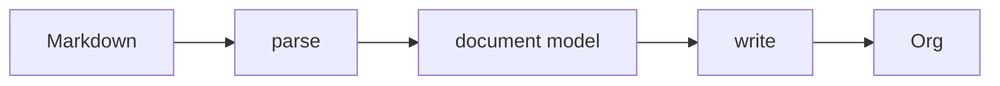

# Design

1. md2org converts Markdown markup to Org markup.
2. Source text that isn't Markdown markup passes through unchanged.



## Invariants
1. Every non-markup character in the source appears in the output.
2. Contents of Markdown code blocks are never transformed.
3. Contents of Markdown comments are never transformed.
4. A construct that passes through unchanged but changes the document's structure
   when Org reads it is reported in the Warnings Footer.
5. Table cell content is never processed as headings or lists.

Invariant 1 is not implemented as a property test — see open issue 3.

## New, simpler design

Earlier versions escaped literal text (`\ast{}`, `\colon{}`, `\zwnj{}`) so Org
would render it the way Markdown did. That's gone. It answered the wrong
question. The `.org` file is the deliverable, not a later export of it, so in building this new design ask:

1. Was Markdown markup converted correctly?
2. Was everything else left alone?

## How Org syntax in the source document fares

| token | Markdown | Org | resolution |
|---|---|---|---|
| `* x` | bullet list | heading L1 | **collision** → Markdown |
| `# x` | heading L1 | comment | **collision** → Markdown |
| `- x` `+ x` `1. x` | list | list | agree |
| `\| a \| b \|` | table | table | agree |
| `-----` | thematic break | horizontal rule | agree |
| `> x` | block quote | — | Markdown only |
| `** x` | — | heading L2+ | Org only |
| `#+KEYWORD:` `: x` `:NAME:` | — | keyword, fixed-width, drawer | Org only |
| `[fn:1] x` `DEADLINE:` `%%(x)` | — | footnote, planning, diary | Org only |

Only one passed-through construct changes document *structure*: two or more
asterisks at line start followed by a space. Org reads it as a headline, which
claims everything after it until the next heading of equal or lower level.

Everything else is line-local. Level-1 headings can't arise at all — a single `*` plus a space is always a Markdown bullet.

Such lines aren't altered, but they're listed in a comment block at the tail:

```org
# md2org warnings:
# line 4: ** Important Reminder **
```

- **Output, not source, line numbers**
- **No message per warning kind** — the line speaks for itself, so new categoreis of warning cost no strings.
- **Absent when there's nothing to say.**
- The only place md2org puts words in the document that the author didn't write.
  Additive, never mutating.

## The parser is forked

Not vendored. A modified copy of commonmark.js.

**Safe** because `test/conformance.js` runs the spec's own 652 examples as data.
Modify the parser however you like: if 651/652 still passes, it's still
CommonMark.

**Stable** upstream — three substantive spec releases in seven years (0.29 2019,
0.30 2021, 0.31 2024, mostly typographical), and commonmark.js last published
0.31.2 in September 2024.

**Necessary** because GFM's delta is small but sits *inside* the block parser.
cmark-gfm's extension docs say AST post-processing is preferred when it works,
and the parser hooks exist for when "a posteriori modification of the AST proves
to be too difficult / impossible to implement correctly" — and GitHub uses the
hooks for tables. Footnotes there aren't an extension at all; they're a parser
option, because they race link reference definitions. A source-level pre-pass
runs before block structure exists, so it can't see containers, which is why
tables and footnote definitions inside lists and quotes go wrong.

**Not a parser swap**: micromark + GFM + mdast is 78.1 KB minified for an AST,
against a whole-file budget near 40 KB. The current parser is 29.6 KB.

**How it is maintained.** `tools/build-vendor.js` patches upstream before
bundling, so every edit is visible in one place and asserted — a missing patch
target fails the build rather than passing silently. Upstream has published
nothing since September 2024 and this fork is small, so there is no plan to
track it; the patches exist for legibility, not for merging. Edit the parser
freely, and prefer the smallest clean change over one that preserves a diff
nobody is going to take.

The conformance suite is the guard: 651/652 of the spec's own examples, run as
data. If they still pass, it is still CommonMark.

## Constraints

The iOS Shortcut's code field is binding. Bytes, line count and line length can
each crash it, and they interact: many short lines are worse than few long ones,
and both extremes crash. The reference shape is the build that was pasted
successfully and used to generate `shortcut/md2org.shortcut`:

| bytes | lines | longest |
|---|---|---|
| 39,054 | 115 | 631 |

`test/size.js` asserts that shape, and carries the full table of every dimension
measured, crashes included. Shapes, not a box: nothing combining the largest
number from two different measurements has ever been pasted, so the limits come
from one file and are raised only by pasting a bigger one.

Removing the escaping layer is what paid for the correctness work — the build is
smaller than the shape it is measured against.

## Outstanding

- ~~Rewrite the escape and render layers against this document.~~ Done.
- ~~Implement the warning block.~~ Done.
- ~~Fork the parser; move tables, footnotes and strikethrough inside it.~~ Done;
  `src/gfm.js` is deleted.
- ~~**Size.** The build is over the shape `size.js` asserts.~~ Done: dead code
  from the pre-fork design and a duplicated link/image handler came out, and the
  build now sits inside the reference shape with room to spare.
- Specs and test suite stay as they are — they're what make the fork safe.
- `docs/` is both the built browser copy and the GitHub Pages site. It works, but
  a generated file is served straight off the default branch. Worth revisiting if
  the page grows.
- Everything else outstanding is a numbered open issue below, rather than
  duplicated here.

## Open issues

### 1. Block delimiters can pair with ones md2org emits

A literal `#+END_SRC` in the source now passes through, where it can close a
block md2org opened. A literal `#+BEGIN_SRC` can find its partner in the
`#+END_SRC` md2org emits for a real fence.

```
- x :: y                - x :: y
> quote                 #+BEGIN_QUOTE
&amp;          →        quote
#+END_SRC               &
___                     #+END_SRC       ← closes the quote
                        #+END_QUOTE
```

This is the one way the contract can produce structurally invalid Org. It was
accepted on reachability grounds: every natural way of writing about Org — a code
fence, a code span, mid-sentence — is already safe, so the delimiter has to be
bare, alone, at the start of a line, in running prose, *and* its NAME has to
match one md2org emits.

Guarding it would cost `#+TITLE:` and friends passing through, which is one of
the contract's best features.

`test/fuzz.js` reports around 7% invalid Org because its corpus carries these
delimiters as fragments. That rate is an artifact of the corpus, not a measure of
real Markdown, and the corpus should not be tuned to hide it.

This is annotated rather than fixed. `fuzz.js` holds an `ACCEPTED` list of the
four failure signatures this issue produces, reports them as a count, and exits
zero; anything else fails the run. The alternative — failing on a condition the
design has decided not to fix — left the suite with no green state, which cost
the only thing a fuzzer is for.

Still open: extend the warning block to list stray `#+BEGIN_`/`#+END_` lines the
way it lists `**`, or re-guard `#+` and lose the pass-through.

### 2. Two generated entities survive

Neither is the escaping the contract forbids: in both cases the wrapper is markup
md2org generates, and Org gives that slot no escape syntax. But they are the only
characters in the output that the author did not write.

- `]]` inside a link description becomes `]\zwnj{}]`. Reachable only through a
  code span or a numeric character reference inside a description; plain `]]`
  there is not a link to CommonMark at all.
- `|` inside a table cell becomes `\vert{}`. GFM makes the author escape the pipe,
  so this only ever fires on content that arrived as `\|`.

Both live in `src/org-escape.js`, which is now the whole of the escaping — the
cell escape used to be inlined in the renderer, which made that module's claim to
completeness false.

### 3. Static validation of the output is weaker than it was

`test/org-validate.js` was a total oracle: it could judge any output without
being told the answer, which is what makes `test/fuzz.js` work. Under the
contract, literal text can look like any Org markup, and nothing in the output
distinguishes text md2org copied from markup md2org generated. Three checks —
link shape, nested bracket links, bare-asterisk lines — had to go, because they
can no longer tell the two apart.

The invariant in §1 is the replacement and is stronger where it applies: every
non-markup character in the source appears in the output. It is not yet
implemented as a property test.

### 4. A code span in a link description still ends the link early

`` [see `a]]b` now](/u) `` emits `[[/u][see =a]]b=]]`, where the link closes at the
first `]]` and the rest is stray text. FEATURES.md marks the fix as planned:
unwrap the code span and keep the characters, which closes this and the first half
of issue 2 together.

Not caught by `test/org-validate.js`, for the reason in issue 3 — the output does
not say which brackets md2org generated.

### 5. `www.` and bare email autolinks are not implemented

The GFM autolink extension. `http://` and `https://` work anyway because Org
recognises a bare URL itself, so only the two forms Org does not know are missing.
