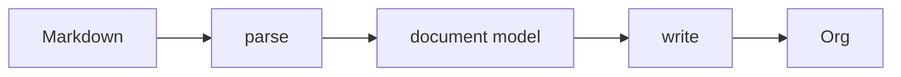

# Design

This document states the rules md2org follows and the reasons for them. What
happens to each individual construct is specified in [MAPPING.md](MAPPING.md).
A construct is named here only to illustrate a rule.

## Purpose

1. md2org converts Markdown markup to Org markup.
2. Some Markdown markup is converted only in part, or not at all.
3. Source text that is not Markdown markup passes through unchanged.



## Scope

The source language is GitHub Flavoured Markdown (GFM) as defined by its
specification, extended with footnotes and LaTeX math.

The following are out of scope: conversion from Org to Markdown; round-tripping;
dollar-sign math (`$…$`, `$$…$$`); GitHub alerts; Markdown dialects other than GFM; and any behaviour
that requires a configuration file.

## Invariants

1. Source text that is not Markdown or HTML markup is never transformed.
2. The contents of Markdown code blocks are never transformed. Comma-quoting
   does not count as a transformation, because Org removes it when it reads the
   block (see [Escaping](#escaping)).
3. The contents of HTML comments are never transformed.
4. All source text that breaks Org document structure is reported in the
   [warnings footer](#warnings-footer).
5. Table cell content is never processed as headings or lists. GFM defines a
   table as a leaf block, so a cell holds inline content only.
6. The contents of LaTeX math are never transformed (see [LaTeX math](#latex-math)).

## Dispositions

Every row in MAPPING.md carries a disposition, which records what md2org does
with the construct.

| Disposition | Meaning |
|---|---|
| Converted | The Markdown markup is replaced by Org markup that carries the same information. |
| Lossy | The markup is converted, but part of the source does not survive, such as a delimiter spelling, a link title or a paragraph break. The loss is silent because Org has nowhere to put the information. |
| Unchanged | The text reaches the output exactly as written. It is either not Markdown markup, Org syntax the author wrote deliberately, or Markdown that md2org does not convert. |
| Warned | The text reaches the output unchanged and is reported in the warnings footer, because Org reads it as document structure. |
| Export hazard | The output is valid Org and its structure is correct, but exporting it produces different text from what a reader of the Markdown would expect. It is not warned, because the Org is valid and may be what the author intended. |

Where more than one disposition applies, the row carries the first that applies
in the order Warned, Export hazard, Lossy, Unchanged, Converted, and the Notes
column records the other.

Warned text is reported rather than escaped because Org offers no escape for it,
with one exception: Org's `\vert{}` entity can stand for a pipe in a table cell,
but md2org generates no Org entities (see
[Character references and entities](#character-references-and-entities)).

## Raw HTML

**Inline HTML is transparent.** In `See <b>**bold** and \`code\`</b> here.` the
tags are raw but nothing else is: the text around and between them was parsed,
and `**bold**` and `` `code` `` arrive as a strong node and a code span,
siblings of the tags rather than their contents. So they convert normally, and
each tag becomes its own `@@html:…@@` snippet. The correspondence is exact in
both directions.

**A block is opaque.** CommonMark suspends parsing for the whole region, and the
literal is the region entire, tags and prose alike. There is no Markdown inside
it to convert, so it passes through whole into `#+BEGIN_EXPORT html`.

### HTML comments

In Markdown, comments are HTML syntax, so they follow the same model. A comment
that CommonMark parses as an HTML block by itself becomes Org comment lines, one
`# ` per line, with the body kept verbatim. A comment that is part of a larger
HTML block stays inside that block's export block, as CommonMark specifies. A
comment followed by text on the same line after `-->` becomes an export block,
because an Org comment would drop the trailing text. An inline comment is inline
HTML and becomes an `@@html:…@@` snippet.

## Character references and entities

md2org decodes no character references by default, named or numeric. There are
two reasons. The table of named references far exceeds the Shortcut's bytes
budget (see [Constraints](#constraints)). And a decoded character can be Org
syntax: `&#42; foo` decodes to `* foo`, a level-1 headline, and `&#35; foo` to
`# foo`, a comment that drops the line from every export.

The CLI (`md2org -e`) and the web page (a checkbox) can decode every reference;
the option is off by default. Org syntax produced by decoding is reported in the
warnings footer under Invariant 4. The Shortcut has no such option, because the
table does not fit.

md2org generates no Org entities. As a consequence, `\|` in a table cell is not
replaced by `\vert{}`, and is warned instead.

## LaTeX math

Org writes LaTeX fragments with the same delimiters that chat interfaces and
MathJax use for Markdown math, `\(…\)` inline and `\[…\]` displayed
(§LaTeX Fragments). md2org therefore copies math unchanged: the forked parser
recognises a math span as a single node, so nothing inside it is parsed as
Markdown and its backslashes are not read as escapes.

`\[` is also CommonMark's escape for a literal `[`, so display math is recognised
only where it is written as display math: `\[` must begin a line and the
closing `\]` must end one. `\(…\)` is recognised anywhere it closes, since
parentheses rarely need escaping. Both require at least one character, so an
empty `\(\)` remains two escapes, and neither may contain its own closing
delimiter, which Org does not allow. CommonMark conformance is unchanged.

## Escaping

All escaping in the program lives in `src/org-escape.js`. The Output escaping
table in MAPPING.md, together with the code-span and table-cell rows it points
to, is the complete list.

Most of it is comma-quoting, Org's own mechanism for protecting lines inside
blocks, which Org reverses when it reads the file. The exception is link paths:
`]` and `\` are percent-encoded by the parser and then backslash-escaped, the
one escape Org's Regular Link syntax sanctions. A link path is Markdown markup,
so this is consistent with Invariant 1, but a path in the output may not match
the source byte for byte.

## Warnings footer

md2org appends a comment block listing every warned construct:

```org
# md2org warnings:
# heading: line 4
# \| in a table cell: line 12, 19
```

There is one line per category, followed by comma-separated line numbers. Line
numbers refer to the output, not the source. A category is listed only if it has
lines, and the block is absent when there is nothing to report. Labels are kept
short to save bytes; each is given in the Notes of the corresponding Warned rows
in MAPPING.md.

## The parser is forked

We do not vendor commonmark.js; we maintain a modified copy. It is necessary to
fork because the features GFM adds sit inside the block parser. GFM tables,
strikethrough, footnotes and LaTeX math are implemented inside the forked
parser, so there is no separate extension layer.

We measure conformity to CommonMark using `test/conformance.js`, which runs the
specification's own 652 examples as data. Upstream is not expected to change
much, if at all: it has had only three substantive specification releases in
seven years (0.29 in 2019, 0.30 in 2021, 0.31 in 2024, mostly typographical),
and commonmark.js last published 0.31.2 in September 2024.

`tools/build-vendor.js` patches upstream before bundling, so every edit is
visible in one place and asserted. The patches exist for provenance, not for
merging. We edit the parser freely, and prefer the smallest clean change over
one that preserves a diff that will likely never be needed in practice.

## Constraints

The iOS Shortcut is the binding constraint on the project. Pasting
`transform.js` into the code field of the Actions app crashes the Shortcuts
editor if the file's byte count, line count or line length is too great. The
three interact: many short lines are worse than a few long ones, and both
extremes crash. The cause of the crash is unknown, so there is no known
definitive limit, and it may vary by OS version or device. All measurements were
made on one device (iPhone 14, iOS 26.x) by pasting files of known dimensions.

The reference shape is the build that pasted successfully and was used to
generate `shortcut/md2org.shortcut`:

| Bytes  | Lines | Longest line |
|--------|-------|--------------|
| 39,054 |   115 |          631 |

`test/size.js` asserts the byte and line counts and carries the full table of
every dimension measured, crashes included. The longest line is recorded
because it was part of the reference build, but it is not asserted. `npm test`
prints the current size and headroom.

The forked parser accounts for about 85% of the file. The rest is the renderer,
the entry point, the escape module and the Shortcut wrapper that `build.js`
appends. The parser cannot be reduced meaningfully, and removing HTML support
would save little. Character-reference decoding was removed from the Shortcut
build in 1.1.0, saving 144 bytes. Earlier estimates of further savings predate
the fork and have been withdrawn; any proposed cut must be re-measured.

## Known limitations

### Line-level syntax inside display math

The parser settles block structure before it recognises inline math, so a line
inside `\[…\]` that begins like a Markdown block, such as `- `, `* `, `# ` or
four spaces of indentation, is parsed as that block, and a blank line ends the
paragraph and with it the equation. Display math as written by chat interfaces
does not do this. A block-level math rule would remove the limitation at a cost
in bytes.

### Block delimiters can pair with ones md2org emits

A literal `#+END_SRC` in the source passes through, where it can close a block
md2org opened. A literal `#+BEGIN_SRC` can find its partner in the `#+END_SRC`
md2org emits for a real fence. Both are warned as `stray block delimiter`, but
the warning does not prevent the pairing.

```
- x :: y                - x :: y
> quote                 #+BEGIN_QUOTE
&amp;          →        quote
#+END_SRC               &amp;
___                     #+END_SRC       ← closes the quote
                        #+END_QUOTE
```

`test/fuzz.js` reports a few per cent invalid Org because its corpus carries
these delimiters as fragments. That rate is an artifact of the corpus, not a
measure of real Markdown, and the corpus should not be tuned to hide it.
`fuzz.js` holds an `ACCEPTED` list of the failure signatures this issue
produces, reports them as a count, and exits zero; any other failure fails the
run.