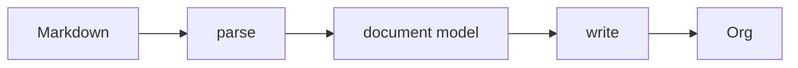

# Design

1. md2org converts Markdown markup to Org markup.
2. Some Markdown markup is converted only in part, or not at all.
3. Source text that isn't Markdown markup passes through unchanged.



## Invariants
1. Every non-markup character in the source appears in the output.
2. Contents of Markdown code blocks are never transformed.
3. Contents of Markdown comments are never transformed.
4. If any text in the source happens to be valid Org syntax that changes how Org
   *parses* the document — a link that ends early, a heading that wasn't there, a
   table row that splits, a block that opens or closes — it is reported in the
   Warnings Footer.
5. Table cell content is never processed as headings or lists.

Invariant 4 is about the parse and nothing else. Syntax that Org parses exactly
as intended, and then exports oddly or not at all, is a different class with a
different remedy: it is documented rather than warned, under *Survives the parse,
not the export* below. Mixing the two would put a warning on every `$x$` in the
document and drown the structural ones that matter.

## Raw HTML

Markdown has allowed HTML since Gruber's original spec, and CommonMark gives the
two forms different rules. md2org follows the parser rather than second-guessing
it, because the parser has already decided which of them the author wrote.

**Inline HTML is transparent.** In `See <b>**bold** and \`code\`</b> here.` the tags
are raw but nothing else is: the text around and between them was parsed, and
`**bold**` and `` `code` `` arrive as a strong node and a code span, siblings of
the tags rather than their contents. So they convert normally and each tag becomes
its own `@@html:…@@` snippet. The correspondence is exact in both directions —
Org's snippet is self-contained too, not an opening and closing pair.

**A block is opaque.** CommonMark suspends parsing for the whole region and the
literal is the region entire, tags and prose alike. There is no Markdown inside it
to convert, so it passes through whole into `#+BEGIN_EXPORT html`, which is Org's
construct for exactly this: content addressed to the HTML backend. A LaTeX or
ASCII export dropping it is not a loss — nothing in there was ever addressed to
them. Comma-quoting keeps a line inside the region from closing the block early,
and works because the content stays inside a block, which is the only place Org
honours it.

The blank-line rule is what separates the two, and it is a fair proxy for intent:
an author who wants Markdown parsed inside their `<details>` leaves a blank line,
and one who has stopped writing Markdown and started writing a chunk of layout
does not.

## Starting point: GitHub Flavoured Markdown (GFM)

Then apply the following.

### Convert

Not in the GFM spec, but converted to an Org equivalent.

- Footnotes

### Pass through, silently

GFM that is not converted. It appears in the Org output as it was in the source,
unescaped, and Org does nothing surprising with it.

- HTML named entities: `&mdash;`, `&hellip;` and the rest. Numeric character
  references, `&#65;` and `&#x41;`, are still resolved by the parser, because
  they are a rule rather than a table and cost almost nothing.

md2org generates no Org entities. There is no `\vert{}`, no `\zwnj{}`, no
`\name{}`. The output contains only characters the author wrote, plus the Org
markup md2org emits for the constructs it converts.

This is not only tidiness. Both entities md2org used to generate could be captured
by an author's own `=` or `~`, and Org does not expand an entity inside a verbatim
span — §Text Markup makes CONTENTS a literal string — so the escape that was
supposed to be invisible was printed to the reader instead. An escape that can be
captured by the text it sits in is not an escape.

### Pass through, with a warning

Passed through untouched, and listed in the Warnings Footer, because Org parses
the result differently from the way the source read. This list is invariant 4.

| Source text | What Org does with it |
|---|---|
| `]]` inside a link description | the link ends early and the rest becomes text |
| a line Org reads as a headline | a heading appears, claiming everything until the next heading of equal or lower level |
| `\|` in a table cell | Org has no escape for a cell, so the cell splits and the backslash stays in the output |
| `#+BEGIN_…` or `#+END_…` on its own line | pairs with a delimiter md2org emitted, opening or closing a block |
| `[[Some Page]]` | read as an Org link |

The headline row is stated as an outcome rather than a construct, because more
than one route reaches it and naming them was how the check kept going wrong.
`** text` in prose is the obvious one. A line inside a block quote is another. So
is `__** * **__`, where Org's strong-emphasis marker is an asterisk and md2org's
own conversion puts three of them at the start of a line — nobody wrote those and
Org still reads a headline.

So the test is on the finished line and admits one exemption: a headline md2org
declared at the moment it emitted one, which is the only point where the answer is
known rather than reconstructed. Everything else that reads as a headline is
reported.

A level-1 heading still cannot arise. A single `*` and a space is always a
Markdown bullet, CommonMark forbids an emphasis opener followed by whitespace so a
converted `__…__` never yields `* `, and an asterisk inside an HTML block never
leaves the block.

### Lossy conversion

Markup md2org silently strips. The characters that go are markup, so invariant 1
is not engaged.

- A link title. `[text](/url "title")`
- Alt text on a badge. `[](/url)`
- `[text]()` becomes `text`
- `[Install](#install)` becomes `Install`

### Survives the parse, not the export

Org parses these the way the document intends. The export is where the content
goes missing. Not structural, so not warned under invariant 4; recorded here
instead, because the list is known to be incomplete and a warning implies a
completeness this class does not have.

| Construct | Where it comes from | What the export does |
|---|---|---|
| A heading whose first word is `COMMENT` | **md2org generates it**, from an ordinary Markdown heading | drops that entire section |
| Raw inline HTML, including `<<anything>>` | md2org wraps it `@@html:…@@` | the tag is dropped for every backend but HTML, so a tag whose content is its own name leaves nothing behind |
| `[fn:1] text` with nothing referencing it | passed through | the definition is dropped |
| `:LOGBOOK:` or `:PROPERTIES:` … `:END:` | passed through | drawer contents are dropped |
| `$x$` in prose | passed through | read as a LaTeX fragment; ASCII leaves it, LaTeX and HTML render it as maths |
| `: like this` at line start | passed through | comes out as boxed monospace |

The `COMMENT` row is the only one md2org causes itself, and the only one that
loses a whole section rather than a fragment.

## Warnings Footer

```org
# md2org warnings:
# heading: line 4
```

- **Output, not source, line numbers**
- One line per category of warning, followed by comma separated line numbers
- **Absent when there are no warnings.**
- The only place md2org puts words in the document that the author didn't write.
  Additive, never mutating.

## The parser is forked

We do not vendor commonmark.js; we maintain a modified copy. We measure
conformity to CommonMark using `test/conformance.js`, which runs the spec's own
652 examples as data. Upstream has had only three substantive spec releases in
seven years (0.29 2019, 0.30 2021, 0.31 2024, mostly typographical), and
commonmark.js last published 0.31.2 in September 2024.

The fork is necessary because GFM's delta is small but sits *inside* the block
parser. cmark-gfm's extension docs say AST post-processing is preferred when it
works, and the parser hooks exist for when a posteriori modification of the AST
proves too difficult to implement correctly — and GitHub uses the hooks for
tables. Footnotes there aren't an extension at all; they're a parser option,
because they race link reference definitions. A source-level pre-pass runs before
block structure exists, so it can't see containers, which is why tables and
footnote definitions inside lists and quotes go wrong.

micromark + GFM + mdast is 78.1 KB minified for an AST, against a whole-file
budget near 40 KB. The current parser is 29.6 KB.

`tools/build-vendor.js` patches upstream before bundling, so every edit is
visible in one place and asserted. The patches exist for provenance, not for
merging. We edit the parser freely, and prefer the smallest clean change over one
that preserves a diff that will likely never be needed in practice.

## Constraints

The iOS Shortcut's code field is binding. Bytes, line count and line length can
each crash it, and they interact: many short lines are worse than few long ones,
and both extremes crash. The reference shape is the build that was pasted
successfully and used to generate `shortcut/md2org.shortcut`:

| bytes  | lines | longest |
|--------|-------|---------|
| 39,054 |   115 |     631 |

`test/size.js` asserts that shape, and carries the full table of every dimension
measured, crashes included.

## Known limitations

### Block delimiters can pair with ones md2org emits

A literal `#+END_SRC` in the source passes through, where it can close a block
md2org opened. A literal `#+BEGIN_SRC` can find its partner in the `#+END_SRC`
md2org emits for a real fence.

```
- x :: y                - x :: y
> quote                 #+BEGIN_QUOTE
&amp;          →        quote
#+END_SRC               &amp;
___                     #+END_SRC       ← closes the quote
                        #+END_QUOTE
```

Guarding it would cost `#+TITLE:` and friends passing through, which is one of
the contract's best features. It is warned rather than fixed, which is what the
Warnings Footer row buys.

`test/fuzz.js` reports a few per cent invalid Org because its corpus carries
these delimiters as fragments. That rate is an artifact of the corpus, not a
measure of real Markdown, and the corpus should not be tuned to hide it.

`fuzz.js` holds an `ACCEPTED` list of the failure signatures this issue produces,
reports them as a count, and exits zero; anything else fails the run. The
alternative — failing on a condition the design has decided not to fix — left the
suite with no green state, which cost the only thing a fuzzer is for.

### Static validation of the output is weaker than it was

`test/org-validate.js` was a total oracle: it could judge any output without
being told the answer, which is what makes `test/fuzz.js` work. Under the
contract, literal text can look like any Org markup, and nothing in the output
distinguishes text md2org copied from markup md2org generated. Three checks —
link shape, nested bracket links, bare-asterisk lines — had to go, because they
can no longer tell the two apart.

Invariant 1 is the replacement and is stronger where it applies: every non-markup
character in the source appears in the output. It is implemented as a property
test in `test/invariant.js`, which `test/fuzz.js` runs on every document it
generates, so it is checked against random input rather than a fixture list.
